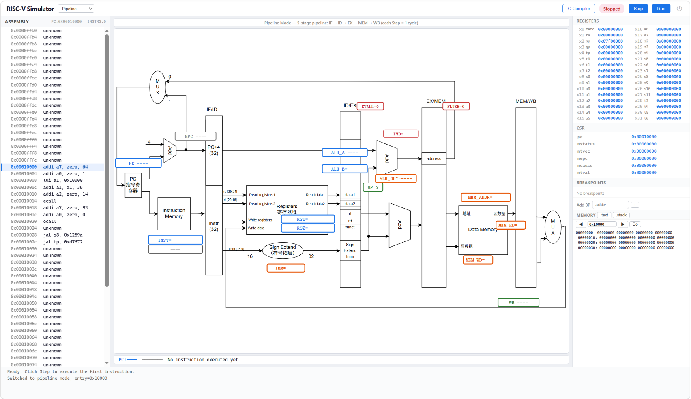

# RISC-V

面向 RISC-V 的模拟器与调试器，支持 RV32I 基础整数指令集、M 扩展（乘除法）及 F 扩展（单精度浮点），能够加载 ELF32 可执行文件并运行。实现了三种 CPU 执行模型（单周期 / 多周期 / 五级流水线）、数据通路可视化、虚拟内存映射（Sv32 两级页表）、常用 Linux 系统调用模拟，以及一个支持断点、单步执行、寄存器/内存查看的交互式调试器，同时提供 Web 端流水线数据通路实时可视化。

Web 调试器界面——单周期/多周期/流水线数据通路实时可视化，支持断点、单步、寄存器/内存查看、在线编译：



> **下载即玩**：前往 [GitHub Releases](https://github.com/teeery/RISC-V/releases) 下载 `riscv-demo.exe`，双击自动启动 Web 调试器。无需安装任何依赖。

## 实现成果

### 指令集（76 条指令）

| 扩展 | 指令数 | 覆盖范围 |
|------|--------|----------|
| **RV32I** | 40 条 | 整数运算 (ADD/SUB/SLL/SLT/SLTU/XOR/SRL/SRA/OR/AND+LUI/AUIPC) · 立即数 (ADDI/SLTI/SLTIU/XORI/ORI/ANDI/SLLI/SRLI/SRAI) · 分支 (BEQ/BNE/BLT/BGE/BLTU/BGEU) · 跳转 (JAL/JALR) · 访存 (LB/LH/LW/LBU/LHU/SB/SH/SW) · 特权 (ECALL/EBREAK/MRET/CSR) · 同步 (FENCE) |
| **M** | 8 条 | MUL/MULH/MULHSU/MULHU · DIV/DIVU · REM/REMU |
| **F** | 28 条 | 算术 (FADD.S/FSUB.S/FMUL.S/FDIV.S/FSQRT.S) · 符号注入 (FSGNJ/FSGNJN/FSGNJX) · 极值 (FMIN/FMAX) · 类型转换 (FCVT.W.S/FCVT.WU.S/FCVT.S.W/FCVT.S.WU/FMV.X.W/FMV.W.X) · 比较 (FEQ/FLT/FLE/FCLASS) · 访存 (FLW/FSW) · 乘加 (FMADD/FMSUB/FNMSUB/FNMADD) |

### CPU 执行模型

| 模型 | 特点 |
|------|------|
| **单周期** (`single`) | 每条指令 1 周期完成，简单直观，CPI=1 |
| **多周期** (`multi`) | IF → ID → EX → MEM → WB 分阶段执行，不同指令不同周期数 |
| **五级流水线** (`pipeline`) | IF/ID/EX/MEM/WB 五级重叠执行 · **Forwarding**（EX/MEM→EX, MEM/WB→EX 前递）· **Stall**（Load-use 冒险自动插入气泡）· **Flush**（分支/跳转错误路径冲刷） |

### 调试器

交互式 CLI 和 Web 两种调试模式，均支持：断点管理、单步执行、寄存器查看（整数 + 浮点）、内存查看、反汇编、调用栈回溯。

Web 调试器额外提供：流水线数据通路实时可视化、在线编译（汇编 -> ELF）、运行状态实时推送。

### Web 调试器 API

```
GET  /                  Web 调试器界面
GET  /api/status        模拟器运行状态
GET  /api/registers     读取 32 个整数 + 32 个浮点寄存器
GET  /api/memory        读取内存区域
GET  /api/backtrace     调用栈回溯
GET  /api/breakpoints   断点列表
POST /api/breakpoint    添加断点
DELETE /api/breakpoint  删除断点
POST /api/step          单步执行
POST /api/continue      继续运行
POST /api/stop          停止运行
GET  /api/datapath      流水线各级寄存器 + Forwarding/Stall/Flush 状态
GET  /api/disassembly   反汇编
GET  /pipeline.svg      流水线数据通路 SVG 图
GET  /api/programs      内置 demo 程序列表
POST /api/program       切换内置 demo 程序
POST /api/compile       在线编译（开发分支功能，依赖 RISC-V GCC）
GET  /api/compile       编译页面（开发分支功能）
```

### 系统组件

| 组件 | 实现 |
|------|------|
| **ELF 加载器** | ELF32 解析 · Program Header 段加载 · Section Header 节解析 · 栈初始化 (argv/envp/AUX) · ELF magic 验证 |
| **MMU** | Sv32 两级页表 · 4KB/4MB 页面 · 虚拟→物理地址转换 · U/S/RWX 权限检查 |
| **系统调用** | `exit` (93) · `write` (64) · `read` (63) · `brk` (214) |

### 测试覆盖

| 测试 | 文件 | 覆盖 |
|------|------|------|
| CPU 译码 | `decode_test.c` | 76 条指令解码正确性 |
| CPU 执行 | `execute_test.c` | RV32I 指令执行 |
| F 扩展 | `f_test.c` | 浮点运算 |
| M 扩展 | `m_test.c` | 乘除法 |
| 多周期 | `multi_cycle_test.c` | 多周期控制器 |
| 流水线 | `pipeline_test.c` | 五级流水线 + Forwarding/冒险 |
| 调试器 | `debugger_test.c` | 断点/单步/寄存器/内存 |
| ELF 加载 | `test_load.c` / `test_validate.c` | ELF 加载与验证 |
| 端到端 | `e2e_test.c` | 完整链路：加载→执行→ecall→退出 (13/13 通过) |

## 项目结构

```
risc-v/
├── src/
│   ├── include/                     # 公共头文件
│   │   ├── simulator.h              #   模拟器顶层接口
│   │   ├── types.h                  #   公共类型定义
│   │   ├── cpu/                     #   CPU 模拟、译码、执行、控制器、ALU
│   │   ├── debugger/                #   交互式调试器 + Web 服务器
│   │   ├── linux/                   #   系统调用模拟
│   │   ├── loader/                  #   ELF 加载器
│   │   └── memory/                  #   物理内存 + MMU
│   ├── src/                         # 模块实现
│   │   ├── main.c                   #   入口 + 命令行解析
│   │   ├── simulator.c              #   模拟器主循环
│   │   ├── cpu/                     #   CPU 实现
│   │   │   ├── cpu.c / decode.c
│   │   │   ├── controller/          #   single_cycle / multi_cycle / pipeline
│   │   │   ├── datapath/            #   ALU 运算单元
│   │   │   └── execute/             #   RV32I / M / F 指令执行器
│   │   ├── debugger/                #   调试器实现 + Web HTTP 服务
│   │   ├── linux/                   #   系统调用模拟
│   │   ├── loader/                  #   ELF32 解析、段加载、栈初始化
│   │   └── memory/                  #   物理内存 + Sv32 MMU
│   └── test/                        # 单元测试
│       ├── cpu/                     #   译码/执行/多周期/流水线/F/M 测试
│       ├── debugger/                #   调试器测试
│       ├── loader/                  #   ELF 加载测试
│       └── e2e/                     #   端到端测试
├── docs/                            # 设计文档
│   ├── 前置知识/                     #   计算机底层知识、数据流追踪、指令编码
│   ├── 设计文档/                     #   各模块设计文档
│   └── tools/                       #   SVG 工具、数据通路编辑器
├── build/                           # 编译产物
├── tools/riscv-gcc/                 # RISC-V GCC 14.2 交叉编译器
└── README.md
```

## 快速开始

### 构建

使用 Visual Studio 打开 `src/` 文件夹（Folder 项目），直接生成即可。编译产物输出到 `build/` 目录。

| 产物 | 说明 |
|------|------|
| `build/riscv-sim.exe` | 模拟器主程序 |
| `build/decode_test.exe` | CPU 译码单元测试 |
| `build/execute_test.exe` | CPU 执行单元测试 |
| `build/f_test.exe` | F 扩展浮点测试 |
| `build/m_test.exe` | M 扩展乘除测试 |
| `build/multi_cycle_test.exe` | 多周期控制器测试 |
| `build/pipeline_test.exe` | 流水线控制器测试 |
| `build/debugger_test.exe` | 调试器单元测试 |
| `build/e2e_test.exe` | 端到端测试 |
| `build/test_load.exe` | Loader 测试 |

### 运行

```bash
# 基本运行
./riscv-sim src/test/e2e/hello.elf

# 指定 CPU 模型（single / multi / pipeline）
./riscv-sim -m pipeline src/test/e2e/hello.elf

# 交互式调试模式
./riscv-sim -s src/test/e2e/hello.elf

# Web 调试器模式（流水线数据通路实时可视化）
./riscv-sim -w 8080 src/test/e2e/hello.elf
# 浏览器访问 http://localhost:8080
```

## 设计文档

- **[从零开始的计算机底层知识](docs/前置知识/计算机知识.md)** — 从 CPU 只认识 0/1 开始，逐层构建到流水线，涵盖机器指令、汇编、ELF 格式、模拟器原理、内存模型、系统调用、调试器、流水线八层内容。
- **[从 C 程序到模拟器执行的完整数据流追踪](docs/前置知识/数据流.md)** — 用一个极简 C 程序 `int main() { return 3; }` 逐步骤展示数据形态从源码到模拟器执行全过程的演变。
- **[RISC-V 指令编码学习笔记](docs/前置知识/RISC-V指令编码学习笔记.md)** — 指令编码格式速查。
- **[Web 调试器使用文档](docs/Web调试器使用文档.md)** — Web 调试器的功能说明与使用方法。
- **[各模块设计文档](docs/设计文档/)** — CPU、调试器、Loader、Memory 的详细设计。

## 未来计划

- **内置轻量汇编器** — 支持在 Web 调试器中直接编写 RISC-V 汇编代码并编译为 ELF，无需安装 RISC-V GCC 工具链。当前 release 版本提供 5 个内置 demo 程序（Hello World / Fibonacci / 冒泡排序 / 递归阶乘 / 质数判定），可通过 Web 界面下拉框随时切换。
- **更多系统调用** — 扩展 Linux syscall 支持（open / close / lseek 等），实现文件 I/O。
- **性能调优** — 流水线前递路径优化、分支预测。

## 版本记录

| 版本 | 日期 | 说明 |
|------|------|------|
| [v0.1.0](https://github.com/teeery/risc-v/releases/tag/v0.1.0) | 2026-07-02 | 首个可运行版本：完整 RV32I 指令执行、ELF 加载器、CPU 单元测试 |
| [v0.2.0](https://github.com/teeery/RISC-V/releases/tag/v0.2.0) | 2026-07-11 | **三级 CPU 控制器 + Web 调试器可视化**：新增多周期/流水线控制器（Forwarding/Stall/Flush）；Web 调试器数据通路 SVG 实时可视化；在线 C 编译；M/F 扩展完整实现（76 条指令）；修复单周期/多周期 Step 不执行、流水线 Step 前 4 周期不可见、断点恢复顺序错误 |

## 参考资料

- [RISC-V 规范](https://riscv.org/technical/specifications/) — 官方指令集手册
- [RISC-V 汇编手册](https://github.com/riscv-non-isa/riscv-asm-manual) — 汇编语法与伪指令说明
